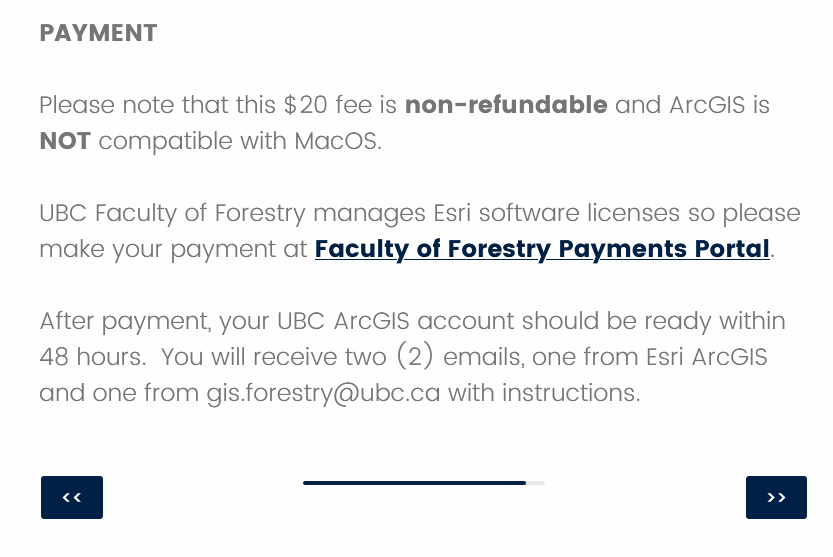

# Lab Access
{: .no_toc }

A major part of your learning in this course is centered on the hands-on application of GIS.  As such, much or your time will be spent working on Application section of each Module.  Your weekly two hour lab is your chance to ask for help from your TA and work through the assignment with fellow classmates.

  

    Table of contents
  

  {: .text-delta }
1. TOC
{:toc}

---

# Lab Sections

Lab attendance is strongly encouraged, but is not mandatory.  You must be registered for one of the following lab sections (all times in PDT/PST).  Labs will meet every week of term with the exception of Week 1 and reading break.  Please direct any email communication regarding Labs to your TA.

* Labs will meet synchronously on zoom for now.
*  When in person resumes, labs will be in room 115.
  * The first hour of in person labs will remain open for zoom drop in as well.

|Lab |           Time slot    |Location                                                                      |
|----|------------------------|-----------------------------------------------------------------------------------|
|L1A |Tuesday/Tursday 15:00-17:00     |In Person, Room 115 Geography Building |
|L1B |Wednesday/Friday 10:00-12:00     |[Zoom Link](https://ubc.zoom.us/j/68713181849?pwd=SThIWUkvVTVtbkpwME11c1NDYlFVZz09)|

# Your TA: Andrea Ku

My name is Andrea and my pronouns are she/her/hers. You can reach me by email: kua12@student.ubc.ca and I am available for offie hours by appointment on Mondays at 11am (in person room 105 or on zoom).

I am a MSc student in Geography, studying fire and climate relationships in continental Southeast Asia. My research background has primarily integrated ecological concepts with GIS and remote sensing techniques. In my free time, I enjoy travelling, eating, and hiking with my dog, Lilo.

# Software and computer access

To complete your lab assignments, you will be using ESRI's ArcGIS Pro.  This is a proprietary (costs money) program that can be operated on a desktop/laptop.  You have two options for accessing the software:

## Option 1: Geography Lab Computers ($20)

The Geography Department has two computer labs (rooms 115 and 237) that may be accessed in-person when the geography building is open (7:30 am to 5:00 pm Mon-Fri *Students with evening classes/labs are given key card access until 8:30 for those particular days*).  The geography lab computers may also be accessed remotely (via remote desktop connection) 24 hours a day, 7 days a week.  To remotely access lab computers, follow [these instructions](RemoteDesktop.pdf).  There is a $20 lab fee to use geography computers.  Every student will be assigned an account to access the Geography computer labs. You must [pay the lab fee](http://geog-epayment.sites.olt.ubc.ca/fees/geoglab-fees/).  After you pay the fee, email Jose Aparicio will send you your logon credentials.  *Jose is very busy at the end of term, it may take him a bit to get you the logon.*

Information about the Geography Computer Labs can be found [here](https://geog.ubc.ca/undergraduate/study-resources/).  In particular, please refer the lab schedule and *refrain from remotely logging onto a lab computers while other courses are holding lab session in that room*.

**If you are having trouble logging on remotely** try: adding "geoglab\" in front of your username.

## Option 2: Purchase a Student License ($20)

You may purchase a student version of the software to install on your own computer for $30. ArcGIS Pro requires a PC (i.e. a computer running Windows) but if you have a Mac or Linux machine you can get around this by building a Windows partition on your hard drive or using a virtual machine.

### Installing ArcPro on Your Computer

**1**{: .label .label-red } Check that your computer meets the system requirements for ArcPro using [this link](http://www.systemrequirementslab.com/Client/Standard/?apikey=50F41142-39B0-4061-97C2-BA7B7FE43D0E&refid=1186&item=12433).

* If you have a Mac or Linux computer, you will first have to set up a Windows partition. You can [follow these instructions](https://support.apple.com/en-ca/HT201468) **Unfortunately we cannot provide any support for this step of the installation.**

**2**{: .label .label-red } Go [here](https://gis.ubc.ca/software/) to purchase, ArcGIS Pro.

* Important Note: ArcGIS Pro is not yet available for download directly from this site
* Payment must be made to through the foresty portal linked on the last step of this page (see image below)
  * Once you make the purchase, send your receipt to Jose Aparicio at: labhelp@geog.ubc.ca Jose will then send you a link to download ArcPro.  *Jose is very busy at the beginning of term, it may take him a bit to get you the logon.*

## Option 3: UBC Library GIS (Last Resort)

This is not a viable solution for the whole semester as computer access is limited.  However, if you are in a pinch, you can access the [Koerner Library GIS Computers](https://remotelabs.ubc.ca/) remotely.

# Saving Your Work

## On Geography Lab Computers

**When you first logon to geography lab computers with your account** find C:\Apps\RunOnce.bat in the file manager.  Double click on it to run it.  This will initalize your account and set up access to your **H:/** drive.

During your lab, you should save your work to **C:\temp**. This is a folder stored locally on the computer you are working on.  Since it's the same machine you're working on, ArcGIS Pro can easily and quickly access and save files in this folder.  **However**, lab computers are accessed by multiple users.  A single computer in room 115 might have 20-30 different students accessing it (in person or remotely) in a given week.  Each time a new user logs on, the C:/temp folder is at risk for being overwritten.  Reference the video and steps listed below for guidance on workign with the lab computers.

  <iframe src="videos/GEOS_270-Saving_Your_Work.mp4" title="Processes" scrolling="no" frameborder="0"
    style="border: 0;
   height: 100%;
   left: 0;
   position: absolute;
   top: 0;
   width: 100%;">
   
Your browser does not support iframes.

 </iframe>

<a href="videos/GEOS_270-Saving_Your_Work.mp4" target="_blank">View Video in New Tab</a>

### Steps for Saving to H:/

It is **EXTREMELY IMPORTANT** that you save your work elsewhere before you log off.  When you sign up for your Geography lab account, you will be given server space known as your **H:/** drive folder; you should save your work here. To do so, follow these steps:

**1**{: .label .label-red } Save your Map document and close ArcGIS Pro or any other software you may be using (Word, Excel, etc. ...)

**2**{: .label .label-red } Launch My Computer, and navigate to C:\temp

**3**{: .label .label-red } Right click on your lab folder in C:\temp and select "Copy"

**4**{: .label .label-red } Navigate to **H:/** and past your lab folder here

### Steps for Retrieving from H:/

When you come back next time to complete the assignment, you will transfer the files in the reverse direction. This is because the H:/ drive is stored on a networked server, not the local machine, and so your machine would work very slowly if you try to work directly from the H:/ drive. To transfer your files:

**1**{: .label .label-red } Log in

**2**{: .label .label-red } Use My Computer to find C:\temp and delete all the files you find there since they are most likely not yours

**3**{: .label .label-red } Navigate to your H drive, select your current lab's folder , and copy it to C: \ temp

**4**{: .label .label-red } Resume your work

## Saving on Your own Computer

You can handle things however you like.  You don't have to worry about someone overwriting or deleting your work because only you have access to your system.  However, you should consider using a remote backup like google drive for current and completed assignments.

## Remote Backup and Collaboration

I suggest folks use a cloud based service (google drive, dropbox etc.) to back up their work.  This is good practice in general and might be worthwhile for you beyond GIS.  Using a cloud based service will make it easier to share data/work with group members when it comes time to work on your final projects.

