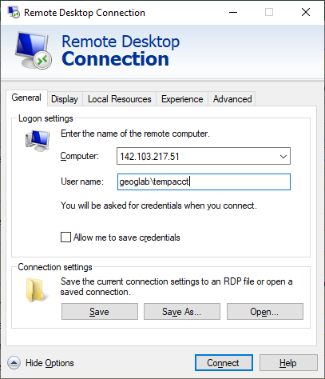
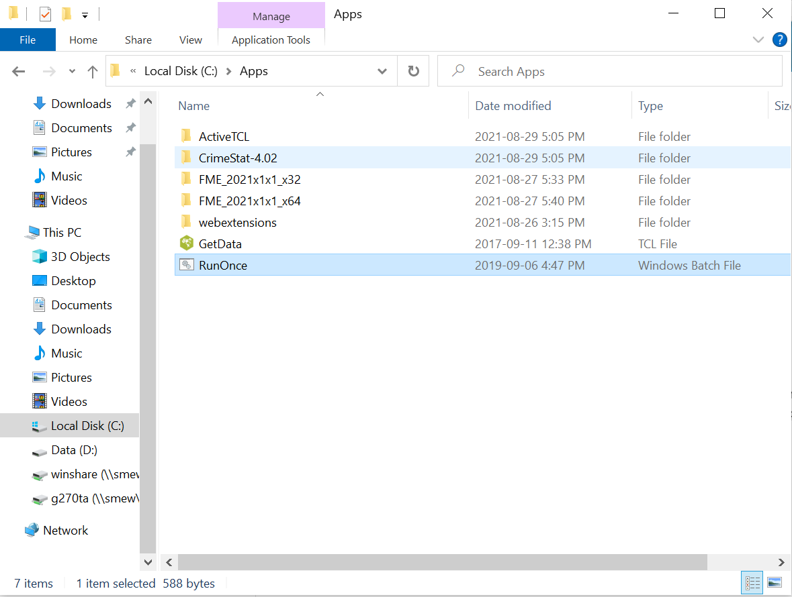

# Software and Computer Access

To complete your lab assignments, you will be using ESRI's ArcGIS Pro.  This is a proprietary program (costs money) that can be run on the Windows opperating system.  You have two options for accessing the software:

  

    Table of contents
  

  {: .text-delta }
1. TOC
{:toc}

---

## Option 1: Geography Lab Computers

All students will be given a UBC Geography logon, you should recieve logon credentials by email before the first day of lab.
The Geography Department has two computer labs (rooms 115 and 237).  Room 115 may be accessed in-person when the geography building is open; room 239 will be closed to in person access this summer due to construction.  Both 115 and 239 can be accessed remotely (via remote desktop connection) 24 hours a day, 7 days a week.  To remotely access lab computers, follow [these instructions](RemoteDesktop.pdf).  Information about the Geography Computer Labs can be found [here](https://geog.ubc.ca/undergraduate/study-resources/).  **Note** the lab schedule and **refrain from remotely accessing a computer while other courses are holding lab session in that room**.

* If you have not received logon credentials, contact Jose Aparicio at: labhelp@geog.ubc.ca 

* If your personal coputer is running Mac or Linux, it is **Strongly Recomened** you use this method to access ArcGIS Pro.

* There is a lab fee to use geography computers: you must [pay the lab fee](http://geog-epayment.sites.olt.ubc.ca/fees/geoglab-fees/) by May 31st or you will loose access to your account.  

* **If you are having trouble logging on remotely** try: adding "geoglab\" in front of your username.

## Option 2: Purchase a Student License

You may purchase a student version of the software to install on your own computer for $30. ArcGIS Pro requires a PC (i.e. a computer running Windows) but if you have a Mac or Linux machine you can get around this by building a Windows partition on your hard drive or using a virtual machine.

* If you have a Mac or Linux computer, you can [follow these instructions](https://support.apple.com/en-ca/HT201468) to setup a partition.
  * **We cannot** provide any support for this step of the installation and it will probably just be easier for you to use Option 1 instead.

**1**{: .label .label-red } Check that your computer meets the system requirements for ArcPro using [this link](http://www.systemrequirementslab.com/Client/Standard/?apikey=50F41142-39B0-4061-97C2-BA7B7FE43D0E&refid=1186&item=12433).

**2**{: .label .label-red } Go [here](https://gis.ubc.ca/software/) to purchase, ArcGIS Pro.  Fill out the info, make your pamment, and you should be given and ArcOnline Account and a link to download ArcGIS Pro.
  * If you run into any issues, contact Jose Aparicio at: labhelp@geog.ubc.ca 

## Option 3: UBC Library GIS (Last Resort)

This is not a viable solution for the whole semester as computer access is limited.  However, if you are in a pinch, you can access the Koerner Library GIS Computers in person in room 217 or the computers in [room 218 remotely](https://remotelabs.ubc.ca/).  These computers are not guranteed to be running most up to dat version of ArcGIS Pro.

---

## Saving/Retreiving Your Work

### On Geography Lab Computers
{: .no_toc }

**When you first logon to geography lab computers with your account** find C:\Apps\RunOnce.bat in the file manager.  Double click on it to run it.  This will initalize your account and set up access to your **H:/** drive.

During your lab, you should save your work to **C:\temp**. This is a folder stored locally on the computer you are working on.  Since it's the same machine you're working on, ArcGIS Pro can easily and quickly access and save files in this folder.  **However**, lab computers are accessed by multiple users.  A single computer in room 115 might have 20-30 different students accessing it (in person or remotely) in a given week.  Each time a new user logs on, the C:/temp folder is at risk for being overwritten.  Reference the video and steps listed below for guidance on workign with the lab computers.

  <iframe src="videos/GEOS_270-Saving_Your_Work.mp4" title="Processes" scrolling="no" frameborder="0"
    style="border: 0;
   height: 100%;
   left: 0;
   position: absolute;
   top: 0;
   width: 100%;">
   
Your browser does not support iframes.

 </iframe>

<a href="videos/GEOS_270-Saving_Your_Work.mp4" target="_blank">View Video in New Tab</a>

#### Steps for Saving to H:/
{: .no_toc }

It is **EXTREMELY IMPORTANT** that you save your work elsewhere before you log off.  When you sign up for your Geography lab account, you will be given server space known as your **H:/** drive folder; you should save your work here. To do so, follow these steps:

**1**{: .label .label-red } Save your Map document and close ArcGIS Pro or any other software you may be using (Word, Excel, etc. ...)

**2**{: .label .label-red } Launch My Computer, and navigate to C:\temp

**3**{: .label .label-red } Right click on your lab folder in C:\temp and select "Copy"

**4**{: .label .label-red } Navigate to **H:/** and past your lab folder here

#### Steps for Retrieving from H:/
{: .no_toc }

When you come back next time to complete the assignment, you will transfer the files in the reverse direction. This is because the H:/ drive is stored on a networked server, not the local machine, and so your machine would work very slowly if you try to work directly from the H:/ drive. To transfer your files:

**1**{: .label .label-red } Log in

**2**{: .label .label-red } Use My Computer to find C:\temp and delete all the files you find there since they are most likely not yours

**3**{: .label .label-red } Navigate to your H drive, select your current lab's folder , and copy it to C: \ temp

**4**{: .label .label-red } Resume your work

### Saving on Your own Computer
{: .no_toc }

You can handle things however you like.  You don't have to worry about someone overwriting or deleting your work because only you have access to your system.  However, you should consider using a remote backup like google drive for current and completed assignments.

