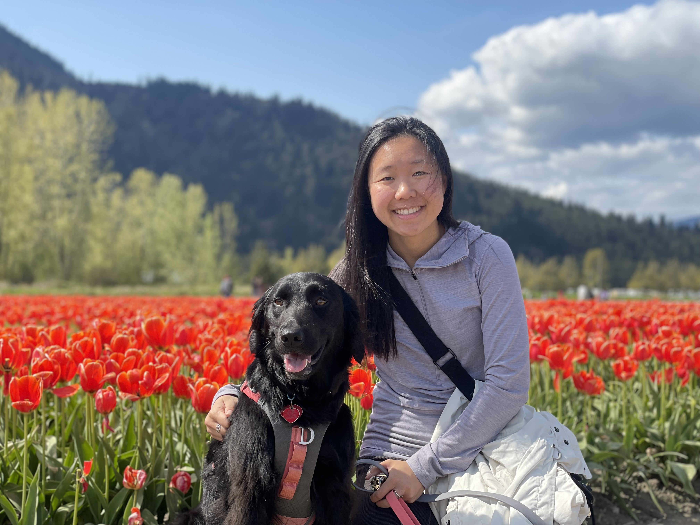

# Geographic Information Science
{: .no_toc }

  

    Table of contents
  

  {: .text-delta }
1. TOC
{:toc}

---

## Learning Outcomes

This course will expose you to key concepts and tools used to collect, map, and interpret geographic data.  We will learn how geospatial data can be used to aid decision-making, complement scientific analysis, assist with urban planning, and help inform policy-making.  You will gain practical experience using geospatial data to solve problems in both the natural and human realms.  This term we will cover:

* How GIS functions and how it can be applied to solve problems.
* How phenomena are represented as geospatial data in a GIS.
* How to implement geospatial analysis methods.
* Visualizing geospatial data and principles of good map design. 
* Sources of error in GIS analysis and output.
* The ethical implications of GIS analysis.
* GIS workflows and collaborating to complete a GIS project.

---

## Course Schedule

|                           Name                            |                               Topics                                |Post Date|                   Due Date                   |
|-----------------------------------------------------------|---------------------------------------------------------------------|---------|----------------------------------------------|
|[Module 1](https://june-skeeter.github.io/Module1_GEOS270/)|History of GIS, Coordinate Reference Systems   Intro to ArcGIS Pro|TBD      |TBD                                           |
|[Module 2](https://june-skeeter.github.io/Module2_GEOS270/)|Data Types & Spatial Data Models                                     |TBD      |TBD                                           |
|[Module 3](https://june-skeeter.github.io/Module3_GEOS270/)|Data Classification & Visualization                                  |TBD      |TBD                                           |
|[Module 4](https://june-skeeter.github.io/Module4_GEOS270/)|Spatial Analysis & GIS Workflows   Final Project Overview         |TBD      |TBD                                           |
|[Module 5](https://june-skeeter.github.io/Module5_GEOS270/)|Spatial Analysis Cont., Sampling & Interpolation, Uncertainty        |TBD      |TBD                                           |
|[Module 6](https://june-skeeter.github.io/Module6_GEOS270/)|GIS Applications & Research, Ethics,  Exam Review                 |TBD      |TBD                                           |
|[Final Project](docs/Final_Project.md)                     |Proposal & Report                                                    |TBD      |TBD                                           |
|[Final Exam](docs/Overview.md/##final-exam)                |Asynchronous on Canvas                                               |TBD      |TBD                                           |

---

## Lecture

Lectures are held Tuesday/Thrusday 12:30-14:00 in room 22 of the Geography building.  Lectures will also be streamed [on zoom](https://ubc.zoom.us/j/68713181849?pwd=SThIWUkvVTVtbkpwME11c1NDYlFVZz09)

---

## Lab Sections

You must be registered for one of the following lab sections, which will meet 2x week each throughout the term.  Lab attendance is strongly encouraged, but is not mandatory.  All labs will meet in person in the Geography computer lab (room 115).

|Lab |   Time slot            |
|----|------------------------|
|L1A |Tuesday 16:00-18:00     |
|L1B |Tuesday 10:00-12:00     |
|L1C |Wednesday 12:00-14:00   |
|L1D |Friday 14:00-16:00      |

---

## Your Instructor

| Name | June Skeeter |
| Pronouns | They/Them/Theirs |
| Email | june.skeeter@ubc.ca |
| Office | Room 144, Geography Bldg. |
| Office Hours| Tuesdays/Thursdays **After** lecture 14:00-15:00   Or [on zoom](https://ubc.zoom.us/j/66359522453?pwd=ZzZUMzV3NVY1V3pzcmYzZFBadW93UT09) *by appointment* |

My name is June and I am a non-binary geographer, researcher, and educator.  I have been living as an uninvited guest on unceded Coast Salish Territory since 2015 and (will soon receive) a PhD in Geography from the University of British Columbia in 2022.

I have been teaching GEOS 270 since 2020.  I am passionate about teaching Geographic Information Science and using Geographic Information Systems as a tool to address social and ecological justice issues.  My principal aim this semester is to provide a holistic introduction to the study of Geographic Information Science and application of Geographic Information Systems.

I use GIS extensively is my research on climate change in the wetland ecosystems.  For my PhD, I studied greenhouse gas exchange remote [Arctic Ecosystems](https://cdnsciencepub.com/doi/full/10.1139/as-2021-0034).  Now I am working for the [UBC Micrometeorology Lab](https://blogs.ubc.ca/saraknox/) studying greenhouse gas exchange in local wetlands in Vancouver.  When I'm not working, I like to spend my free time hiking, gardening, foraging, and going to drag shows.  

---

## Your TAs

| Name | Andrea Ku |
| Pronouns | She/Her/Hers |
| Email | kua12@student.ubc.ca |
| Office | Room 105, Geography Bldg. |
| Office Hours| Mondays at 11 am, or by appointment. Please email if you prefer to meet on Zoom! |

My name is Andrea and I am a MSc student in Geography, studying fire and climate relationships in continental Southeast Asia. My research background has primarily integrated ecological concepts with GIS and remote sensing techniques. In my free time, I enjoy traveling, eating, and hiking with my dog, Lilo.

